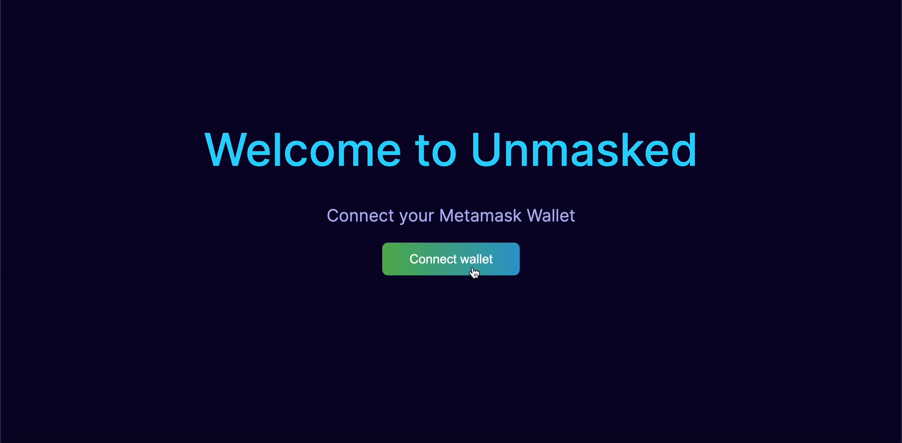

# Unmasked

## Portfolio view for your Metamask wallet

An app that displays a user's crypto wallet in a portfolio view with key metrics: net worth, token distribution, yearly gains/losses. UnMasked gives a clear view on a wallet to help the user make better trades.

*JavaScript, React, Ethers, ChartJS*

  

